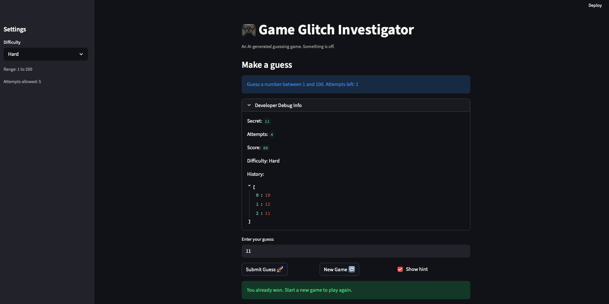

# 🎮 Game Glitch Investigator: The Impossible Guesser

## 🚨 The Situation

You asked an AI to build a simple "Number Guessing Game" using Streamlit.
It wrote the code, ran away, and now the game is unplayable.

- You can't win.
- The hints lie to you.
- The secret number seems to have commitment issues.

## 🛠️ Setup

1. Install dependencies: `pip install -r requirements.txt`
2. Run the broken app: `python -m streamlit run app.py`

## 🕵️‍♂️ Your Mission

1. **Play the game.** Open the "Developer Debug Info" tab in the app to see the secret number. Try to win.
2. **Find the State Bug.** Why does the secret number change every time you click "Submit"? Ask ChatGPT: _"How do I keep a variable from resetting in Streamlit when I click a button?"_
3. **Fix the Logic.** The hints ("Higher/Lower") are wrong. Fix them.
4. **Refactor & Test.** - Move the logic into `logic_utils.py`.
   - Run `pytest` in your terminal.
   - Keep fixing until all tests pass!

## 📝 Document Your Experience

- [x] Describe the game's purpose.
      The purpose of the game is to guess a secret number within a certain range. The range varies depending on the selected difficulty level. Playes can choose to display hints when you submitting a guess. If the correct number is guessed, the player wins.

- [x] Detail which bugs you found.
  1.  The difficulty levels weren't labeled reasonably because the hard level's upper bound was smaller than normal level's.
  2.  Clicking the "New Game" button didn't properly start a new game. Only the answer changed while the attempt count stays the same.
  3.  The latest guess only appeared in the history list on the next run, which was counterintuitive.

- [x] Explain what fixes you applied.
  1.  I changed the range for hard level so that its upper bound is larger than the normal level's. I also ensured the easy level bahaved correctly by running pytests and manually playing the game.
  2.  I updated the `if new_game:` branch in `app.py` to ensure the related session states were properly initialized when "New Game" button is clicked. I verified the fix using both pytest and manual testing.
  3.  Initially, I added `st.return()` after the submit logic so that the guess history would update immediately after submission. While this fixed the history display, it caused the hint to disappear. I then adjusted the implementation by storing the hint in `st.session_state`, which allowed the hint to persist across reruns. The fix was verified with pytests and manual testing.

## 📸 Demo

## 🚀 Stretch Features

- [ ] [If you choose to complete Challenge 4, insert a screenshot of your Enhanced Game UI here]
